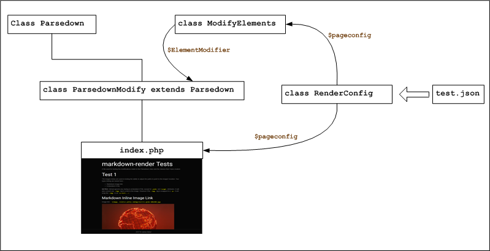
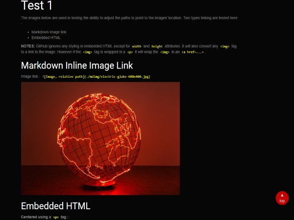

# markdown-render
A PHP project that renders markdown files from GitHub repositories. Based on Parsedown (http://parsedown.org)

# History

Initially I was looking for a way to render *markdown* files for a blog project I was working on. The intent at that time was to be able to render small markdown files that were to be used as blog entries.

However, later on I found that I wanted to render my GitHub README and project documentation files for use on my personal website. And the intent there was to have the ability to showcase README content without having to direct visitors to my GitHub account.

I had investegated a number of potential solutions and determined that [Parsedown](http://parsedown.org) would work best for my applications. 

# Features

The following features are *enhancements* to the operation of the original Parsedown - 

* Extended with the `ParsedownModify` class. Added two functions - 
    * `modifyVoid()` - modifies the `src` attribute for in-line `` tags. For example, the images in this file are `` tags wrapped in `<p>` tags. *This is intentional, and aids in editing.*
    * `modifyInline()` - modifies the GitHub flavored images : ``
    * Utilizes the `ModifyElements` class to effect changes to the image and link tags.

Here are the application features - 

* Configurable - The following items are configurable via JSON formatted files which can be chosen using a query when the page is loaded into a browser.
    * GitHub Access -
        * Can be configured to retrieve the markdown file from a GitHub repository using the following options -
            * Repository Name
            * Owner
            * Branch
            * Markdown file - The file can be local or hosted on GitHub
    * Generates Static HTML - An optional setting controls this feature, the output file name is also configurable.
        * Meta Tags - Can be configured in the JSON file or can be retrieved from the GitHub repository.
            * Meta Description
            * Meta Keywords
    * Additional Features   - 
        * "Go to Top" button - A simple "go to top" button that can be reused on any web page. It is implemented with the following - 
            * `assets/css/totop.css`
            * `assets/js/totop.js`
            * an HTML button located at the bottom of the document space - `<button id="gototop" class="gototop" onclick="jumpToTop()" title="Go to top of page">&#9650;<br>top</button>`
* Modifies resource paths for images. The configurable GitHub settings are used in on-the-fly modification of image tags so that the `src` attributes point to the correct location.
* Modifies resource paths for in-line links such as `[test.md](./test.md)` and adds `target="_blank"` to the resulting HTML link. The configurable GitHub settings are used in on-the-fly modification of link tags so that the `href` attributes point to the correct location. **Note :** The code expects a *relative path* to the root of the repository.

# Implementation Overview

PHP was the primary technology used in this project. It provides all of the necessary capabilities needed to access and render the markdown content to HTML.

## Application Architecture

<p align="center">
  
</p>

## Requirements

* PHP - Version 5.6 was used in development and testing. It was chosen because *standard hosting* was the targeted platform.
* Web Server - This project can be hosted on a internet accessible host. However for initial use and testing a local server such as [XAMPP](https://www.apachefriends.org/index.html) is recommended. This project was developed and tested on XAMPP - [xampp-win32-5.6.31-0-VC11-installer.exe](https://sourceforge.net/projects/xampp/files/XAMPP%20Windows/5.6.31/xampp-win32-5.6.31-0-VC11-installer.exe/download)
* Web Browser - My preferred browser is *Chrome*.

# Running the Project

1. Download this repository as a zip file.
2. Unzip the contents to your hard drive.
3. Create a folder in `c:\xampp\htdocs` called `tests\mdrender`.
4. Copy the following into  `c:\xampp\htdocs\tests\mdrender` - 

* Folders & contents - 
    * `nbproject` - *not required if running on a hosting server*
    * `assets`
    * `mdimg`
* Files - 
    * `index.php`
    * `Parsedown.php`
    * `ParsedownModify.php`
    * `RenderConfig.php`
    * `github.json`
    * `test.json`
    * `test.md`

5. Run XAMPP and start Apache (*not necessary if running on a hosting server*)
6. Open your browser and navigate to - `http://localhost/tests/mdrender/index.php`
7. The page you see *should* look like this - 
 
<p align="center">
  
</p>

Here is the file in GitHub - [test.md](./test.md) (*right-click and open in a new tab or window*).

## Configuration

**github.json :** Typically it will not be necessary to edit this file. It contains *GitHub* specific configuration items that are not likely to change often.

```
{
    "reporaw"  : "https://raw.githubusercontent.com/",

    "repogit"  : "https://github.com/",

    "repoapi"  : "https://api.github.com/",
    "accheader": [
                    "application/vnd.github.v3+json",
                    "application/vnd.github.mercy-preview+json"
                 ],
}
```

**test.json :** This file and its contents are specific to the Markdown file that you want to render. 

```
{
    "owner"    : "jxmot",
    "repo"     : "markdown-render",
    "branch"   : "master",

    "mdfilerem": true,
    "mdfile"   : "test.md",

    "pagetitle": "markdown-render Test",

    "gitdesc"  : false,
    "metadesc" : "",

    "gittopics": false,
    "metakeyw" : "",

    "metaauth" : "https://github.com/jxmot",

    "genstatic": false,
    "statname" : "./test.html"
}
```

It *should not be* necessary to edit the following in the `github.json` file - 
* `reporaw`
* `repogit`
* `repoapi`
* `accheader`

The following found in `test.json` can be edited as needed - 
* `owner` - this is the owner of the repository where the markdown file to be rendered is residing.
* `repo` - the repository name that contains the markdown file
* `branch` - the branch that contains the markdown file
* `mdfilerem` - if **`true`** the application will obtain the markdown file *from* the repository, if it is **`false`** it will look for the file locally
* `mdfile` - the name of the targeted markdown file
* `pagetitle` - this will become the text between the `<title>` tags in the rendered output
* `gitdesc` - if **`true`** the application will obtain the description from the specified repository, if **`false`** it will use the text found in `metadesc`
* `metadesc` - optional, used if `gitdesc` is `false`
* `gittopics` - **`true`** the application will obtain the topics found in the repository and place them in the meta keywords as a comma separated list, if **`false`** it will use the text found in `metakeyw`
* `metakeyw` - optional, used if `gittopics` is `false`
* `metaauth` - optional, fills in the meta author tag if there if it has text in it
* `genstatic` - if **`true`** the application will create a static HTML file from the rendered output.
* `statname` - the name of the generated static HTML file, since the rendered file will use the CSS and JS files it is best to save it in the current location (i.e. `./`)

Additional JSON files can be created as needed and contain different repository information. To run the application using a different JSON file is accomplished using a *query*. For example if a JSON file named `myreadme.json` is to be used then point the browser to - `http://localhost/tests/mdrender/index.php?cfg=myreadme`.

## Other Modifiable Items

The bulk of the page styling is done with Bootstrap and a CSS file(`assets/css/document.css`). The coloring and some other style adjustments in that CSS file are tailored for use with the cyborg Bootstrap theme. 

# Development and Debugging

* Development Operating System - Windows 10 64bit

I used XAMPP and NetBeans 8.2(PHP) to develop and debug this project. In order to properly debug with the NetBeans IDE it is necessary to modify the XAMPP `php.ini` file. Contrary to the majority of on-line resources the *correct* settings are - 

```
[XDebug]
zend_extension = "./php_xdebug.dll"
; XAMPP and XAMPP Lite 1.7.0 and later come with a bundled xdebug at <XAMPP_HOME>/php/ext/php_xdebug.dll, without a version number.
xdebug.remote_enable=1
xdebug.remote_host=127.0.0.1
xdebug.remote_port=9000
; Port number must match debugger port number in NetBeans IDE Tools > Options > PHP
xdebug.remote_handler=dbgp
xdebug.profiler_enable=1
xdebug.profiler_output_dir="<XAMPP_HOME>\tmp"
```

Add the section above to your `php.ini` file. Under XAMPP it is located at `C:\xampp\php\php.ini`. In addition, this repository contains the NetBeans project settings files. They are located in `/nbproject`. After you have XAMPP and NetBeans installed it *should be* possible to open the project in Netbeans.

## Running under NetBeans

* Run NetBeans
* Then File->Open Project and navigate to `c:\xampp\htdocs\tests\mdrender` and open the project

NetBeans will allow you to set breakpoints and examine variables.

## Running on a Host

Copy the files as described in [Running the Project](#running-the-project) to a folder on your server's *document root*. To run the test render navigate your browser to - `http[s]://yourserver/yourfolder/index.php`. The default configuration is in `test.json`. To run a different JSON configuration file create one with the appropriate modifications (*use* `test.json` *as a starting point*) and copy it to the folder on your server. Then you can navigate to - `http[s]://yourserver/yourfolder/index.php?cfg=yourconfig`.

# IMPORTANT Things to Note

The version of *Parsedown* used in this repository is realatively old. It was created *around* May 2017. I estimate that the version would have been 1.6.3, however the author(s) did not update the version number string in `Parsedown.php`.

There have been a large number of changes made at [Parsedown](https://github.com/erusev/parsedown) since the time when the current version was first obtained. ~~I plan on updating the local copy of Parsedown after activivity has settled down in the Parsedown repository~~.


