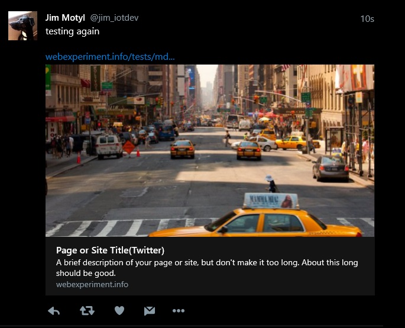
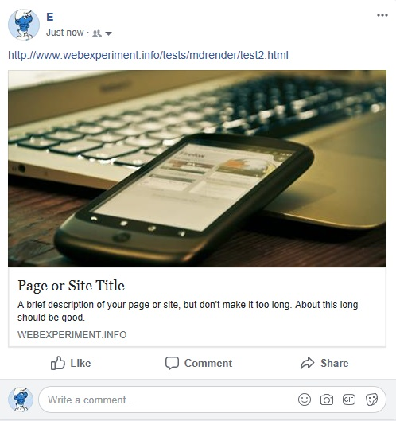

# oghead-example-test.json

There are a couple of *sections* in the JSON file, they are grouped as - 

* `twitter` : Twitter Card sharing<br>
    1) Link title, URL, and description<br>
    2) Twitter-site owner of the account posting the link, card type, and creator (also your twitter handle)<br>
    3) [Placeholder](https://placeholder.com/) enable flag, URL base, foreground & background colors, text, image width & height, and image type<br>
    4) Link image URL, image width & height<br>
    
* `og` : This is for all other non-twitter shares<br>
    1) Link title, URL, and description<br>
    2) Site type and name<br>
    3) [Placeholder](https://placeholder.com/) enable flag, URL base, foreground & background colors, text, image width & height, and image type<br>
    4) Link image URL, image width & height<br>
    5) Mime Image type<br>

```
{
    "prefix": "og: http://ogp.me/ns# fb: http://ogp.me/ns/fb# website: http://ogp.me/ns/website#",
    
    "twitter": { /* meta tag config data */ },
    
    "og": { /* meta tag config data */ }
}
```

The JSON key values shown below are for *testing purposes __only__*. 

## Configuration Details

Use this as your `prefix` attribute for the `<head>` tag when using Open Graph meta tags.

```
{
    "prefix": "og: http://ogp.me/ns# fb: http://ogp.me/ns/fb# website: http://ogp.me/ns/website#",
```
### Twitter
<i id="twcard"></i><br>
**#1 Twitter Card : Link title, URL, and description**<br>

**`title`** : This is displayed as the Twitter Card title. See [Output Examples](#output-examples) to see where it shows up.<br>
**`url`** : The URL to the site or page that clicking the link will bring you to.<br>
**`description`** : A brief description, shown under the `title` on the link.<br>

```
    "twitter": {
        "title": "Page or Site Title(Twitter)",
        "url": "http://www.webexperiment.info/tests/mdrender/test2.html",
        "description": "A brief description of your page or site, but don't make it too long. About this long should be good.",
```

<i id="twsite"></i><br>
**#2 Twitter-site owner of the account posting the link, card type, and creator (also your twitter handle)**<br>

**`site`** : @username for the website used in the card footer.<br>
**`card`** : The card type, which will be one of “summary”, “summary_large_image”, “app”, or “player”.<br>
**`creator`** : @username for the content creator / author.<br>

```
        "site": "@YourTwitterHandle",
        "card": "summary_large_image",
        "creator": "@YourTwitterHandle",
```

<i id="phold"></i><br>
**#3 [Placeholder](https://placeholder.com/) enable flag, URL base, foreground & background colors, text, image width & height, and image type**<br>

As an *alternative* to static images you can use *placeholder* images. There are a number of resources on the web but I chose [Placeholder.com](https://placeholder.com/) because it's very simple to use and it's free. The only catch has been with the on-image text. 

**`use_ph`** : if `true` then the Placeholder image will be used<br>
**`image_ph`** : This is the base URL for Placeholder, the code assembles the complete URL from this and the following pieces<br>
**`bgcolor_ph`** : An RGB color but without the "`#`"<br>
**`fgcolor_ph`** : An RGB color but without the "`#`"<br>
**`text_ph`** : Some optional text to overlay onto the image<br>
**`imagewidth_ph`** : Width of the image<br>
**`imageheight_ph`** : Height of the image<br>
**`imagetype_ph`** : Prefferred type, jpg, png, gif. Not optional for Placeholder images, this field also gets used in the `og:image:type` meta tag to build the `image/????` string <br>

```
        "use_ph": false,
        "image_ph": "http://via.placeholder.com/",
        "bgcolor_ph": "381aff",
        "fgcolor_ph": "6eff3d",
        "text_ph": "some text goes RIGHT here",
        "imagewidth_ph": "1556",
        "imageheight_ph": "778",
        "imagetype_ph": "jpg",
```
<i id="linkimg"></i><br>
**#4 Link image URL, image width & height**<br>

**`image`** : a URL to a static image, used if `use_ph` is false<br>
**`imagewidth`** : image width<br>
**`imageheight`** : image height<br>

```
        "image": "https://raw.githubusercontent.com/jxmot/markdown-render/master/assets/img/placeimg_1000_800_arch-01.jpg",
        "imagewidth": "1000",
        "imageheight": "800"
    },
```

### LinkedIn, Facebook, and Others

**#1 Link title, URL, and description**<br>

Please see the [Twitter Card section](#twcard) for details.

```
    "og": {
        "title": "Page or Site Title",
        "url": "http://www.webexperiment.info/tests/mdrender/test2.html",
        "description": "A brief description of your page or site, but don't make it too long. About this long should be good.",
```
**#2 Open Graph Object Type**<br>

**`type`** : right now I'm only using `website`, there are a lot of others decribed in the Open Graph [documentation](http://ogp.me/#types)
**`site_name`** : The name of the site which contains the resource linked to in `url`

```
        "type": "website",
        "site_name": "This is My Site",
```

**#3 [Placeholder](https://placeholder.com/) enable flag, URL base, foreground & background colors, text, image width & height, and image type**<br>

See the [Placeholder section](#phold) above for the details.

```
        "use_ph": false,
        "image_ph": "http://via.placeholder.com/",
        "bgcolor_ph": "403dff",
        "fgcolor_ph": "000000",
        "text_ph": "some OTHER text goes here",
        "imagewidth_ph": "1200",
        "imageheight_ph": "796",
        "imagetype_ph": "jpg",
```

**#4 Link image URL, image width & height**<br>

See the [Link Image section](#linkimg) above for the details.

```
        "image": "https://raw.githubusercontent.com/jxmot/markdown-render/master/assets/img/placeimg_1000_800_tech-01.jpg",
        "imagewidth": "1000",
        "imageheight": "800",
```

**#5 Mime Image type**<br>

This will indicate the type of image for Placeholder and static images.

```
        "imagetype": "image/jpg"
    }
}
```

# Output Examples

The samples below were the results of the meta tags that were created with the configuration shown above. And as expected Twitter will display a different image than the others. 

**Twitter :**

<p align="center">
  
</p>

**Facebook :**

<p align="center">
  
</p>

**LinkedIn :**

<p align="center">
  
</p>

# Related Files in this Repository

* Referenced in this document - 
    * `oghead-example-test.json` - 
        * static image files, those images were obtained from [PlaceIMG](https://placeimg.com/)

* Closely Related Files -
    * `test.json` - the `ogjson` field in this file contains the path and file name to JSON file containing the Open Graph configuration as described in this document.
    * `head.php` - renders the Open Graph meta tags, also renders additional `<head>` tag contents.
    * `index.php` - includes `head.php`

# Useful Resources

* [The Open Graph protocol](http://ogp.me/) - documentation
* [About Twitter Cards](https://developer.twitter.com/en/docs/tweets/optimize-with-cards/overview/abouts-cards) - documentation
    * [Card Validator](https://cards-dev.twitter.com/validator) - Twitter card validator
* [Facebook A Guide to Sharing for Webmasters](https://developers.facebook.com/docs/sharing/webmasters)
    * [Facebook Open Graph Object Debugger](https://developers.facebook.com/tools/debug/og/object/)
* [Social Debug](http://socialdebug.com/) - tests against Facebook, Twitter, Google+, and LinkedIn and "grades" the results.

# What's Next?

What's been described here is only a small portion of the capabilities and use of Open Graph. I plan on exploring everything else Open Graph can do and I will update this document and it's associated application code  as I learn more. 

----

<p align="center">
  &copy; 2018 Jim Motyl
</p>
